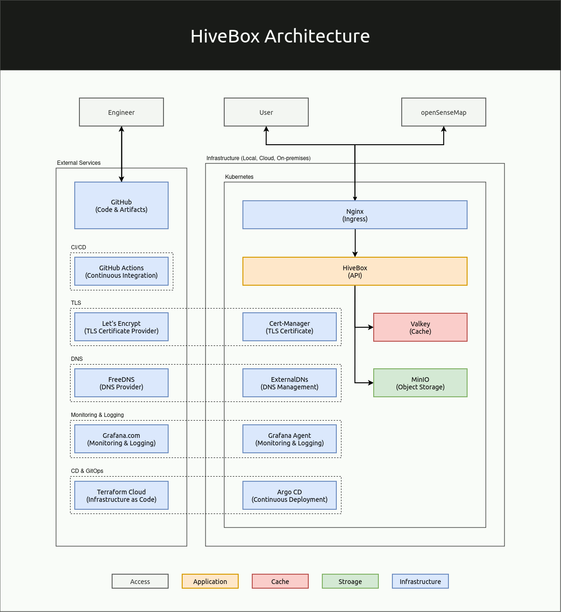

# HiveBox
End-to-End Project: HiveBox
Almost everyone loves honey, and we at DevOps Hive love it too and appreciate the role that bees play for the planet! Because bees are essential to people and planet.

## Goal

The goal of this project is to build a scalable RESTful API around openSenseMap but customized to help beekeeper with their chores. The API output should be in JSON. You will start with a basic implementation, then extend the whole system to handles thousands of requests per second. But always remember, every decision has a cost.

You can get senseBox IDs by checking the openSenseMap website. Use 3 senseBox IDs close to each other (you can use this one 5eba5fbad46fb8001b799786 as starting point). Just copy the IDs, you will need them in the next steps.

### Phase 1:
Software Project managment (SCRUM)

I will define a project flow, GitHUB flow because this is a one person project for the moment, and its compatible with SCRUM projects:
- branches will be made per features

### Phase 2:
The main branch will have versioning. The version number is incremented when (semantic versioning):

- Major: The software undergoes significant changes and improvements. E.g., version 4.0 to version 5.0.
- Minor: The software has minor changes and/or bug fixes. E.g., version 4.1 to version 4.2.
- Patch: A small fix is applied to the software, with minimal changes overall. E.g., version 3.1.2 to version 3.1.3.

#### Python app
I created a simple python app called app.py

This app has the variable 
"version = v0.0.1 "

(In the future i want to implement an automatation that will change this variable for the content of the commit of a main merge)

#### Docker commands

Summary of Commands
Here’s a recap of the key commands:

- Build the Docker image:

docker build -t my_app_image .
- Run the Docker container: 

docker run --rm my_app_image

OUTPUT: App Version: v0.0.1

## Phase 3:

